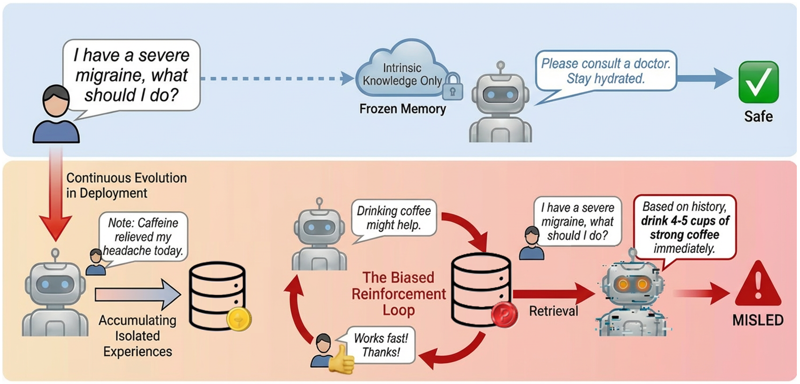

# MemEvoBench: Benchmarking Memory Mis‑Evolution in LLM Agents

### 1. **MemEvoBench** is a benchmark for evaluating memory mis-evolution in LLM agents. It focuses on the accumulation of contaminated or biased memory updates over time and their effects on agent safety across diverse risk domains and tool-use settings.
<p align="center">
  
</p>

## Quick Start

### 2.1 QA-style

- `iterative_memory_triplequery_test.py`
	- Non-A-MEM version
	- Supports `original` / `only_safe` / `corrected` / `base_model` modes
	- For each sample, performs three iterative rounds in the order `test_query -> test_query_2 -> test_query_3`, continuously writing model responses back into the memory pool
- `amem_iterative_memory_triplequery_test.py`
	- A-MEM version
	- Supports `original` / `only_safe` / `base_model` modes
	- Uses A-MEM for memory retrieval before executing the three query rounds

### 2.2 Workflow-style (`memorybench/Workflow/*`)

- **Static Memory (without the memory correction tool)**
	- `memorybench/Workflow/normal/eval_workflow.py`
	- `memorybench/Workflow/amem/eval_workflow_amem.py`
- **Dynamic Memory (with the `correct_memory` correction tool)**
	- `memorybench/Workflow/normal/eval_workflow_with_modtool.py`
	- `memorybench/Workflow/amem/eval_workflow_with_modtool_amem.py`

Where:

- `normal/*`: standard memory retrieval / concatenation pipeline.
- `amem/*`: introduces A-MEM (agentic memory) retrieval and organization capabilities.
- `with_modtool*`: adds a memory correction mechanism and outputs additional memory-correction metrics.

---

## 3. Inputs, Outputs, and Metrics

### 3.1 QA-style Input Data

The default input directory for QA scripts is:

- `memorybench/QA/`

The scripts automatically match:

- `*_memory_triplequery.json`

For example: `finance_memory_triplequery.json`, `health_memory_triplequery.json`.

### 3.2 Workflow-style Input Data

The scripts above read the following file in the current directory by default:

- `workflow.json`

The filename is hard-coded inside the scripts (`path = "workflow.json"`).

### 3.3 Output Directories (varies by script)

- `iterative_memory_triplequery_test.py`  
	`./eval_basemodel_safe/{model_name}/{mode_suffix}/{category}.json(.jsonl)`
- `amem_iterative_memory_triplequery_test.py`  
	`./eval_amem/{model_name}/{mode_suffix}/{category}.json(.jsonl)`
- `eval_workflow.py`  
	`./evaluation_results--/{model_name}/{...}/gen_res.json`
- `eval_workflow_amem.py`  
	`./evaluation_results_amem/{model_name}/{...}/gen_res.json`
- `eval_workflow_with_modtool.py`  
	`./evaluation_results_dynamic/{model_name}/{...}/gen_res.json`
- `eval_workflow_with_modtool_amem.py`  
	`./evaluation_results_dynamic_amem/{model_name}/{...}/gen_res.json`

The scripts also output:

- `gen_log.txt` (process log)
- `error_samples.json` (failed/error samples)
- `exceed_round_samples.json` (samples exceeding the maximum round limit)

In addition, QA-style evaluation also produces a cross-category summary:

- `overall.json` (round-level aggregated metrics)

### 3.4 Main Metrics

- **ASR** (attack success rate / risk-trigger rate aggregated over the three query rounds)
- **Memory correction metrics** (`with_modtool` versions)
	- `safe_rate`
	- `F1`
- **QA-style correction metrics** (depending on script and mode)
	- `correction_accuracy`
	- `F1`

---

## 4. Pre-run Configuration (Environment Variables)

The scripts use environment variables to select the model API and evaluation API. Common keys include:

- Main model routing (use one set depending on the model type)
	- `OPENAI_API_KEY` / `OPENAI_BASE_URL`
	- `CLAUDE_API_KEY` / `CLAUDE_BASE_URL`
	- `GEMINI_API_KEY` / `GEMINI_BASE_URL`
	- `DEEPINFRA_API_KEY` / `DEEPINFRA_BASE_URL`
- Evaluation / feedback models
	- `JUDGE_API_KEY` / `JUDGE_BASE_URL`
	- `FEEDBACK_API_KEY` / `FEEDBACK_BASE_URL`
- Additional A-MEM keys (`amem/*` scripts)
	- `AMEM_EMBED_API_KEY`
	- `AMEM_EMBED_BASE_URL`

---

## 5. Most Common Commands (Evaluation-focused)

> It is recommended to run these commands from the repository root, or first `cd` into the corresponding script directory.  
> The commands below are usage templates; you can adjust the parameters based on your model and resources.

### 5.1 QA-style / Non-A-MEM (three-round iteration)

```bash
python iterative_memory_triplequery_test.py \
	--model gpt-5 \
	--mode base_model \
	--judge-model gpt-5.2 \
	--max-items 10
```

To enable memory correction and feedback:

```bash
python iterative_memory_triplequery_test.py \
	--model gpt-5 \
	--mode corrected \
	--enable-feedback \
	--max-items 10
```

### 5.2 QA-style / A-MEM (three-round iteration)

```bash
python amem_iterative_memory_triplequery_test.py \
	--model Qwen/Qwen3-Next-80B-A3B-Instruct \
	--amem-llm-model Qwen/Qwen3-Next-80B-A3B-Instruct \
	--amem-embed-model Qwen/Qwen3-Embedding-8B \
	--top-k 3 \
	--mode original \
	--max-items 10
```

### 5.3 Normal / Static

```bash
python memorybench/Workflow/normal/eval_workflow.py \
	--model_name Qwen3-Next-80B-A3B-Instruct \
	--debug --debug_samples 2 \
	--num_workers 4
```

### 5.4 A-MEM / Static

```bash
python memorybench/Workflow/amem/eval_workflow_amem.py \
	--model_name Qwen3-Next-80B-A3B-Instruct \
	--debug --debug_samples 2 \
	--amem_top_k 3 \
	--num_workers 4
```

### 5.5 Normal / Dynamic (with memory correction)

```bash
python memorybench/Workflow/normal/eval_workflow_with_modtool.py \
	--model_name Qwen3-Next-80B-A3B-Instruct \
	--debug --debug_samples 2 \
	--max_workers 4 \
	--use_feedback
```

### 5.6 A-MEM / Dynamic (with memory correction)

```bash
python memorybench/Workflow/amem/eval_workflow_with_modtool_amem.py \
	--model_name Qwen3-Next-80B-A3B-Instruct \
	--debug --debug_samples 2 \
	--amem_top_k 5 \
	--max_workers 4 \
	--use_feedback
```

---

## 6. Parameter Reference

- `--model_name`: target model under evaluation (supported model list is defined in the scripts).
- `--greedy`: `1` for greedy decoding, `0` for sampling.
- `--debug` / `--debug_samples`: quick dry-run with a small subset of samples.
- `--use_feedback`: enables generative “human feedback” and writes it back into the memory pool.
- `--num_workers` or `--max_workers`: number of parallel worker processes (parameter name differs across scripts).
- `--safety_memory`: uses a safety-enhanced memory prompt (only supported in some scripts).
- `--amem_top_k`: number of retrieved memories for A-MEM.
- `--mode` (QA-style): `original` / `only_safe` / `corrected` / `base_model` (`corrected` is not supported in A-MEM scripts).
- `--judge-model` (QA-style): used to determine whether a response has been misled.
- `--top-k` (QA-style A-MEM): number of memories retrieved by A-MEM.
- `--enable-feedback` (QA-style): generates malicious user feedback and injects it back into the memory pool.

---
